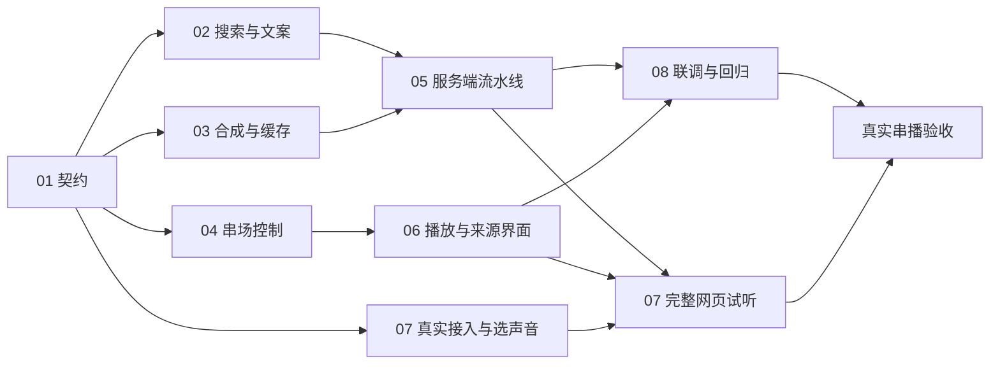

# DJ 串场：开发任务与依赖

状态：2026-09-17 实施完成（01–06 done；08 离线阶段完成，真实阶段待 07）。01：契约模块 29 测试；02：真实搜索验证含民间说法归因样例；03：Fish/缓存替身 20 测试；04：控制器 22 测试；05：流水线 15 测试 + 路由；06：浏览器串播冒烟 12/12（注入模式）；07：Codex 已验证，Fish/音色待凭据；08：`verification/report.md`。真实歌→DJ→歌验收待用户配置 Fish 密钥并选定音色。
依据：[规格](spec.md)、[开发契约](contract.md)、[访谈记录](interview-record.md)、[接入核验](verification/access.md)、[验收报告](verification/report.md)。

## 交付目标

用户收听时，歌曲之间能播放介绍下一首的中文 DJ；资料和传闻都有出处，生成与语音失败不影响音乐。实现沿用本机 Codex、Fish 免费模型及网页单个音频出口。

## 独立任务

| 编号 | 任务 | 前置任务 | 主要交付 |
| --- | --- | --- | --- |
| [01](issues/01-program-contract.md) | 节目条目、来源与串场状态契约 | 无 | 统一数据校验、接口形状、有效性与状态事件 |
| [02](issues/02-research-and-script.md) | 搜索资料并生成带来源的文案 | 01 | Codex 搜索/写稿、来源与民间说法归因、基础介绍降级 |
| [03](issues/03-fish-audio-cache.md) | 免费语音合成及音频缓存 | 01 | Fish 适配、有效 MP3、缓存与免费配置约束 |
| [04](issues/04-segue-controller.md) | 串场频率与机会控制 | 01 | 可离线验证的准备/播放决定，不直接操作 DOM/audio |
| [05](issues/05-server-pipeline.md) | 服务端生成流水线与接口 | 02、03 | 准备/查询/取消/音频接口、幂等、超时与冷却 |
| [06](issues/06-player-and-source-ui.md) | 单音频播放与文案来源界面 | 04 | 歌曲/DJ 分派、控制、反馈隔离和配置展示 |
| [07](issues/07-live-access-and-voice.md) | 真实接入及音色试听 | 核配置需 01；完整网页试听需 03、05、06 | Codex 搜索验证、免费 TTS 准入、用户确认声音 |
| [08](issues/08-integration-verification.md) | 联调、回归与真实串播验收 | 05、06；真实阶段另需 07 | 故障与竞态证据、真实歌→DJ→歌、剩余边界 |

依赖表示正式交付顺序；任务 05 可提前按已固定契约用替身接线，任务 06 不必等真实 Fish 服务。07 的凭据核实尽早进行，不阻塞 02–06 的离线开发。

## 并行与共享文件

- 第 1 波：01 完成后，02、03、04 独立并行；有空闲人员时同步推进 07 的账户配置核实。
- 第 2 波：05 接后端、06 接前端，分别按契约使用替身验证；随后合并真实链路。
- 第 3 波：08 完成可控故障回归和真实串播。07 未完成时可先交付离线结果，但不能把真实阶段标为通过。
- `server/codex.js` 由 02 负责；`server/index.js`、`server/db.js` 由 05 统一接入；`public/app.js`、`public/index.html`、`public/style.css` 由 06 负责；`package.json` 的脚本改动由 08 统一整理。其他任务需要改这些文件时先交付接口需求，不并发改同一文件。
- 03 如需依赖库，先交给负责集成的人员顺序修改包清单和锁文件，再继续；不和 08 并发改包文件。01/04 的纯模块和测试独立文件落地。
- 不要求每个任务另开进程或 worktree；只有确实并行且写入范围独立时委派。整体结果由负责人回读、集成和验证。

## 可检查的交付点

1. **契约通过**：同歌不同条目不串台；来源与传闻归因能携带到文案；前后端共用状态规则。
2. **离线串播通过**：可控音频完成歌→DJ→歌，跳过/暂停/停止/迟到及目标变更不抢播、不重复计数。
3. **真实接入通过**：实际搜索资料可回读、免费 TTS 可用且音色被选定；没有把接口文档或假数据算成功。
4. **真实浏览器通过**：至少一次自然结束的真实歌曲→完整 DJ→下一首真实歌曲出声，另核对民间说法的实际语音归因。

## 状态与完成判据

用户已完成 Q9 整体确认。01–06、08 标为 `ready-for-agent`，表示信息完整、可按依赖交给开发；不表示这些任务已经执行或前置任务已经完成。07 保留 `needs-info`：实际服务环境的 Fish 凭据/免费准入和试听后的音色选择仍需落实。

第一个可执行入口是 [01 · 节目契约](issues/01-program-contract.md)。01 交付后展开并行任务；08 可在 05/06 完成后先做离线与可控浏览器验收，真实阶段必须等 07 完成。

开发编排交付已完成：规格、契约、8 个独立工单及共同理解确认均已齐备，链接与依赖已核验。功能开发完成仍以 08 的报告与真实证据为准。无效占位、跳过的真实测试、未取得凭据均不能写成已完成。

## 本轮未执行

没有提交 Git；真实 Fish 合成、音色试听与真实歌→DJ→歌验收因缺少凭据未运行（详见 07/08）。

## 实施记录（2026-09-17）

按依赖顺序以 TDD 完成代码实现：先写测试再实现，每步全绿后进入下一任务。共 7 个新模块、
4 个测试文件 100 项用例、1 个浏览器冒烟脚本。改动未提交，等待用户检查。

## 复核问题修复（2026-09-16 第二轮）

复核复现出 9 处功能问题（1 处 P1、8 处 P2），已按同一 TDD 方式逐条修复；随后第二轮复核
又确认 4 处遗留问题（停止后迟到试听、试听中点歌、重播同一首歌、旧媒体 error 误伤），
同样先红后绿修完。当前：单测 106/106、浏览器回归 39/39（原有 12 + 复核 27），
逐项根因、修复与红/绿证据见 [`verification/report.md`](verification/report.md) 第 3.5、3.6 节。修复涉及
`public/app.js`、`public/program-contract.js`、`public/segue-controller.js`、
`server/fish.js`、`server/mp3-duration.js`、`server/dj-pipeline.js`（仅注入模式配置）。
真实 Fish 合成与真实「歌曲→DJ→歌曲」仍未验证，仍等凭据。
