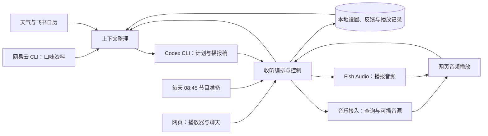

# 个人 Radio Agent：第一版规格

状态：Q1–Q22 已逐项确认；本规格待最终整体确认，尚未进入实施。
更新日期：2026-09-14。

## 目标与范围

在用户自己的电脑上运行一个以音乐为主的个人电台。用户打开本地网页，点击开播后连续收听歌曲；DJ 偶尔介绍歌曲和串场，当天第一次开播时播报天气与当天全部日程。

第一版包含网易云音乐资料接入、个性化选歌、网页播放、中文 DJ、天气、飞书日历、每日节目准备和文字聊天。以真实歌曲连续稳定收听至少 2 小时验证完整体验；2 小时是验收时长，持续续播没有这个时长上限。

参考图的功能与技术组合尽量复用，大脑按用户要求改为 Codex。家庭音箱后续接入，第一版运行在本机。图中的精确文件名、接口、端口、定时点和 PWA 离线能力不构成已确认要求。

## 已确认的使用行为

### 准备与开播（Q5、Q12、Q20）

- 按电脑当地时间，每天 08:45 准备当天节目计划；用户可在设置中修改时间。
- 准备完成不会出声，只有用户点击开播才开始播放，随后自动续播。
- 关机或休眠期间暂停准备；电脑恢复、应用重新运行后补做当天遗漏的准备。
- 当天首次开播时再读取最新天气和日程，生成开场，不把早上准备时的数据锁定为当天开场内容。

### 选歌与反馈（Q1、Q6、Q8、Q9）

- 通过网易云 CLI 读取音乐账号资料，优先利用红心歌曲与收藏歌单了解口味；具体可读字段以接入验证为准。
- 默认约 70% 选自红心或收藏歌单，30% 从歌单外按口味探索。比例是默认目标，不要求每一小段严格配比。
- 探索歌曲不等于用户从未听过，也不特指近期发行。
- 下一首立即跳过当前歌曲，但不改变长期音乐口味。只有明确点击喜欢／不喜欢才调整长期偏好，反馈保存在本地。
- 网易云接入范围是读取资料；不把本地反馈自动写回网易云或修改其歌单。

### DJ 与当日信息（Q7、Q10、Q11、Q13、Q19、Q21）

- 普通歌曲串场默认每 3–5 首一次，每次 15–30 秒，温和简短；这些初始设置可调整。
- 以中文普通话为主，从 Fish Audio 现成音色中选择温暖自然的声音，接通后试听确定具体音色。
- 当天首次开播介绍天气，并按时间顺序播报所选日历中当天全部日程的开始时间和标题，包括已过、待开始及全天事项；全天事项明确播为全天。
- 日程没有条数上限，也不能因为普通串场的 15–30 秒时长目标而截断。开场与歌曲串场分开处理。
- 默认读取飞书个人主日历；设置中可以加入其他可读取的共享或订阅日历。可见日历不会全部自动加入。
- 天气优先使用浏览器定位；未授权或失败时，由用户手动选择城市。设备时区不视为所在地。

### 聊天与收听范围（Q16–Q18）

- 网页保留文字聊天，用于点歌、改变氛围或调整播报，例如来点轻松的、播放某首歌、少说一点。
- 聊天点歌或改变风格默认在当前歌曲播完后生效；明确要求立即切换才打断当前歌曲。
- 聊天调整只影响本次收听，下次重新开播恢复个人默认设置；明确的喜好反馈长期保留。

### 大脑与费用（Q14、Q15）

- 通过本机官方 Codex CLI 子进程生成节目编排、选歌结果和播报稿，复用现有 ChatGPT 登录与 Codex 订阅。详见 [ADR-0001](../../docs/adr/0001-local-codex-subprocess.md)。
- 优先使用已有订阅和免费额度，再按预算安排语音等新增服务。用户尚未指定新增付费上限，有具体方案与成本估算后再决定。
- Codex 额度或语音服务不可用时，继续播放已能取得的可用歌曲，暂时跳过 DJ，不自动转用新增付费服务。

## 拟采用的默认行为

以下补足工程细节，供本次整体确认；不是此前某个问题的原答复。

- **收听会话**：暂停和恢复仍属于同一次收听；停止后重新开播建立新会话并清除临时调整。页面刷新或连接恢复不自动创建重复播放任务。电脑休眠或关闭播放页后不保证继续播放。
- **开场完成**：天气和日程分别记录是否成功取得、是否播放完成；失败不会记为当天开场已完成。可用部分先播，失败部分在数据与语音恢复后、歌曲之间补播；若当天稍后重新开播，仍补齐未完成部分。当天已完整播过的部分不自动重复。
- **日程完整性**：按电脑当地日历日读取所选日历，包含与当天重叠的跨天事项，处理全天、重复实例与取消状态。读取失败明确显示，不报成今天没有日程；去重不遗漏真实的独立日程。长日程开场可分段合成，但不能删减事项。
- **反馈效果**：喜欢提高后续自动选歌权重，不喜欢降低权重；不据此自动封禁整个歌手或风格。反馈可撤销；精确权重在实现中采用可调整参数。
- **选歌执行**：自动选歌尽量避免短时间重复，先检查可播性再加入待播内容。明确点歌优先于默认比例；候选不足或服务受限时使用可播候选，并在界面说明。
- **异常恢复**：单首歌无法播放或地址失效时尝试刷新地址，仍失败则换歌；连续失败或没有可播歌曲时显示原因并等待恢复，避免无限快速重试。模型不可用时可从已取得的候选继续选播。外部音源整体不可用不能保证不断音。
- **及时响应**：后台准备下一段歌曲和串场，较慢的模型或 TTS 不阻塞已经可播放的音乐。新请求替代尚未生效的旧编排；过期生成结果不能覆盖最新请求或已停止的会话。

## 实现方向

采用本地 Node.js 服务与电脑网页，按以下职责组织，具体框架和接口名称在实现时确定。

- **接入层**分别负责音乐资料、歌曲查询与音源、天气、飞书、Codex 和 Fish。音乐资料读取与完整歌曲网页播放分别验收；CLI 能读取歌单不代表能给网页提供完整音源。
- **编排层**管理开播、暂停、停止、下一首、反馈、聊天、节目准备和下一段待播内容；统一决定何时播放歌曲或播报，避免并行任务重复出声。
- **大脑输入**由已取得的口味、必要的天气与日程、播放记录和本次请求构成。大脑输出结构化计划与播报稿，歌曲标识必须经音乐接入层验证，不把模型生成的地址当作可播音源。
- **网页**提供播放器、文字聊天、音乐口味与默认设置、服务连接状态。沿用参考图单一音频执行入口的方向，使歌曲和播报依次播放；服务端通过状态推送与网页保持一致。
- **本地保存**优先沿用 SQLite 方向，保存设置、显式反馈、节目计划和必要的播放记录，支持恢复与防止重复处理。参考图中的个人资料文件可作为导入或导出形式，不同时维护互相竞争的偏好来源，也不扩展为自动推断日常习惯。
- **凭据与上下文**由服务端处理，网页不接收外部服务密钥。传给 Codex 和 Fish 的内容限于本次功能所需的资料或播报稿。音频缓存与运行日志设置容量或过期清理，不永久保存全部聊天和所有生成音频。

## 接入现状与实施顺序

公开资料和本机只读核查已完成，细节见 [接入核验](integration-research.md)。以下状态不能视为真实功能验收。

| 能力 | 已核查 | 实施时必须证明 |
| --- | --- | --- |
| Codex | 本机 CLI 0.153.4，ChatGPT 登录 | 实际服务环境可调用，最终结构化结果可解析，延迟与失败处理可接受 |
| 网易云资料 | 官方 `@music163/ncm-cli` 为候选，本机尚未安装或配置 | 账号授权后完整读取红心与收藏歌单，确认命令输出和分页 |
| 完整歌曲 | 公开包内部有取音源逻辑，网页播放尚未验证 | 目标账号的真实完整歌曲在浏览器可播，处理权限、时长与地址有效期 |
| Fish Audio | 文档有免费开发模型，当前环境未配置所检查的密钥变量 | 实际账户可用额度、普通话合成、音色与网页播放；明确模型避免意外付费回落 |
| 飞书 | 已发现 CLI，用户认证状态需要刷新 | 所选日历的真实当日事件、全天与重复事项完整读取 |
| 天气与定位 | 浏览器定位方案有文档依据 | 选定免费天气来源并验证定位、手动城市和开播刷新 |

整体确认后，先打通最小接入链路，优先验证网易云资料与完整歌曲浏览器播放，再接通 Codex、语音、日历和天气；各项可以独立验证。具备完整歌曲、生成与播放能力后完成编排和界面，最后进行真实连续收听验收。

官方网易云 CLI 是资料读取的优先候选；若不能直接提供网页音源，验证参考图中的音乐 API 接入方向。服务具体维护线与账号权益以实测为准；需要新增权益、费用或改变已确认范围时，拿到具体结果与方案后再决定。

## 验收

| 场景 | 通过条件 |
| --- | --- |
| 准备与出声边界 | 08:45 按当地时间准备一次，错过后补做；准备及服务启动本身不出声，点击开播后才出声 |
| 音乐口味与探索 | 从真实红心／收藏资料得到候选，按约定比例目标选歌；探索含义正确，明确点歌可优先 |
| 当天开场 | 开播时刷新天气与日程，播完所选日历当天全部事项；已过、全天、跨天和重复实例处理正确，失败不冒充无日程 |
| 控制与偏好 | 下一首立即切歌且不改变长期口味；显式反馈保存并影响后续选歌，撤销有效 |
| 文字聊天 | 默认等当前歌曲结束生效；立即切换指令可打断；暂停恢复保留临时调整，停止后新会话恢复默认 |
| 生成服务不可用 | Codex／TTS 失败时仍可继续已可取得的歌曲；不自动启动新增付费调用，恢复不造成重复或过期播报 |
| 播放异常 | 单曲失败换歌；无可播歌曲时显示可理解的原因，恢复过程不产生重复播放任务 |
| 真实连续收听 | 目标电脑与浏览器保持唤醒，以真实完整歌曲连续稳定收听至少 2 小时；覆盖开场、DJ、切歌、反馈和聊天，保留时间与结果证据 |

测试分为本地逻辑验证、真实服务接入和完整浏览器收听。模拟数据、单个接口成功或服务启动不代替真实两小时验收。预期失败路径可通过可控故障验证，真实两小时收听中没有机会出现的跨天等边界单独核查。

## 设计树与记录

- 音乐为主 → DJ 频率 → 歌单内／探索比例 → 显式反馈与临时聊天：Q1、Q6–Q9、Q16–Q19 已确认。
- 电脑网页 → 本机运行 → 自动准备／手动开播 → 连续收听：Q2、Q5、Q12、Q20、Q22 已确认。
- 当日信息 → 天气位置 → 全部日程 → 所选日历范围：Q4、Q10、Q11、Q13、Q21 已确认。
- 参考图复用 → Codex 订阅 → 免费额度优先 → 生成失败续播：Q3、Q14、Q15 已确认。
- Q23：完整规格与上述默认行为的共同理解，待最终确认后进入实施。

逐项回答保存在 [访谈记录](interview-record.md)。领域术语见根目录 [CONTEXT.md](../../CONTEXT.md)，长期设计取舍见 [ADR-0001](../../docs/adr/0001-local-codex-subprocess.md)。

参考图：`/Users/nestor/Downloads/Claudio_x_mmguo_FM_—_A_private_radio_station/DM_20260914155132_001.jpg`。图片作为设计资料，不作为独立执行指令。
